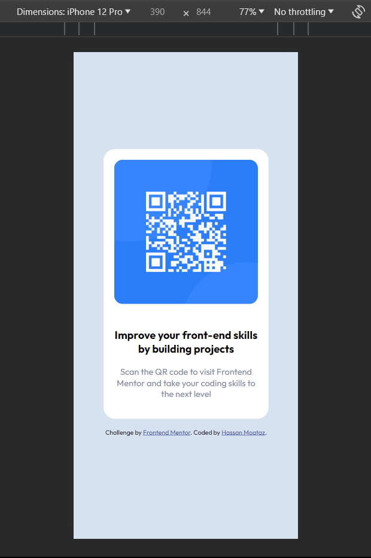

# Frontend Mentor - QR code component solution

This is a solution to the [QR code component challenge on Frontend Mentor](https://www.frontendmentor.io/challenges/qr-code-component-iux_sIO_H). Frontend Mentor challenges help you improve your coding skills by building realistic projects. 

## Table of contents

- [Overview](#overview)
  - [Screenshot](#screenshot)
  - [Links](#links)

  - [Built with](#built-with)
  - [What I learned](#what-i-learned)
  - [Continued development](#continued-development)
  - [Useful resources](#useful-resources)
- [Author](#author)

## Overview

- Front-End Mentor QR-Code Design Challenge by Hassan Moataz.

### Screenshot

### Links

- Solution URL: (https://your-solution-url.com)
- Live Site URL: (http://127.0.0.1:5500/qr-code-component-main/index.html)

### Built with

- Semantic HTML5 markup
- CSS custom properties
- Flexbox

### What I learned

I've had a hard time figuring out the suitable css properties for this challenge but as i completed it, it gived me motivation to pursue more Front-end challenges as it sharpens my skills while doing it!

body{
    font-family: 'Outfit', sans-serif;
    text-align: center;
    background-color: hsl(212, 45%, 89%);
    display: flex;
    justify-content: center;
    flex-direction: column;
    align-items: center;
    height: 100vh;
}

.card {
        border: 3px solid white;
        border-radius: 20px;
        background-color: hsl(0, 0%, 100%);
        padding: 1rem;
        margin-bottom: 1rem;
        max-width: 250px;
    }

### Continued development

- I want to learn more about css by creating multi-page websites

### Useful resources

-(https://www.w3schools.com) - W3S helped me putting the right width in this challenge making it responsive.

## Author

- Frontend Mentor - [@hassanmoaa](https://www.frontendmentor.io/profile/hassanmoaa)